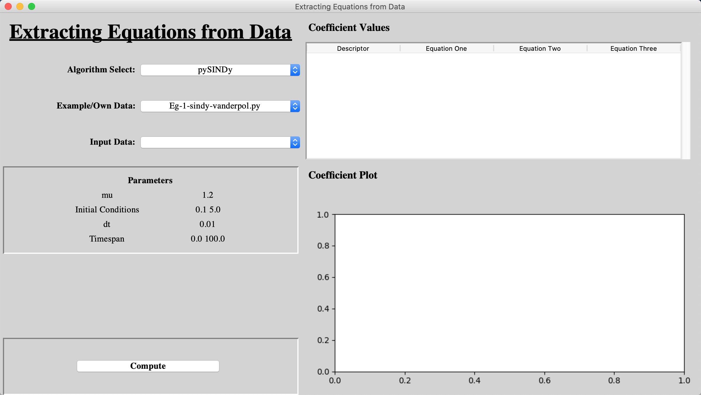
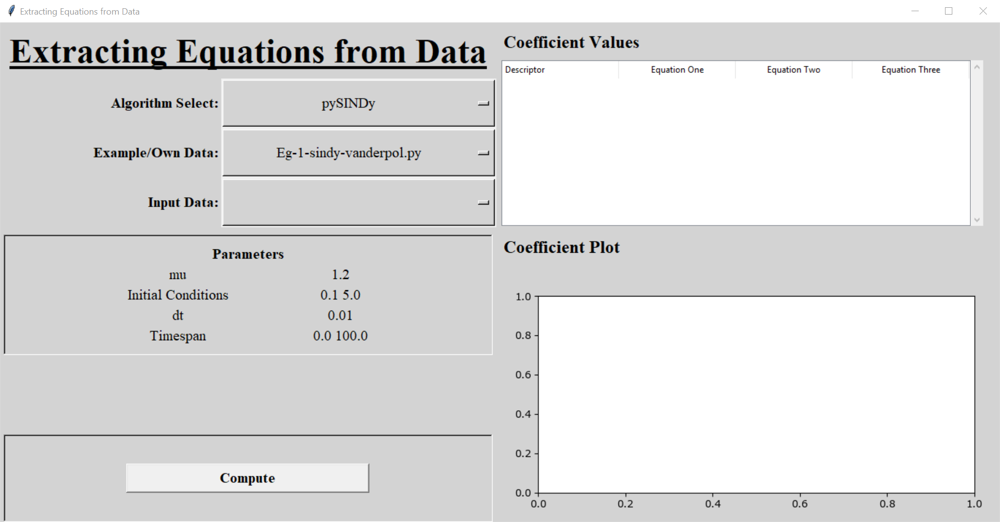
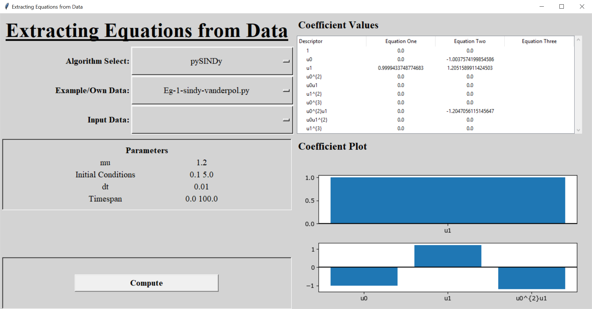
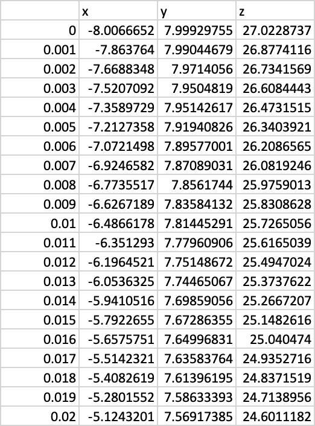

# SEED
 
**SEED**: **S**oftware for the **E**xtraction of **E**quations from **D**ata

## Table of contents
* [Introduction](#introduction)
* [Getting Started](#getting-started)
	* [Prerequisite](#prerequisite)
	* [Installing](#installing)
* [Usage](#usage)
	* [Running SEED](#running-SEED)
	* [Examples](#examples)
	* [Using your own data](#using-your-own-data)
* [Expansion](#expansion)
* [License](#license)

## Introduction
SEED is a software written in Python that allows for the extraction of governing differential equations from data. We have collated various algorithms written for research purposes into one overall toolbox and provided a GUI for their ease of use. Currently, there are two different algorithms integrated into SEED:

* The MATLAB SINDy codebase written by the [Kutz Research Group](https://faculty.washington.edu/kutz/page26/) to accompany their papers [Discovering governing equations from data by sparse identification of nonlinear dynamical systems](https://www.pnas.org/content/113/15/3932.abstract) and [Data-driven discovery of partial differential equations](https://advances.sciencemag.org/content/3/4/e1602614)
* [PySINDy](https://github.com/luckystarufo/pySINDy), written by [Yuying Liu](https://amath.washington.edu/people/yuying-liu) along with Yi Chu and Lianzong Wang, following on from the research of the Kutz Research group and other SINDy research

Both algorithms use the Sparse Identification of Nonlinear Dynamics (SINDy) method, although we are aware that there are others, and provide different implementations of it.  
We have edited the examples provided with each algorithm in order to integrate them into SEED, but they otherwise remain unedited.  
We have also adapted each algorithm to give SEED the ability to import a users' own data, therefore enabling the analysis of further real-world datasets.

SEED has a simple and intuitive Graphical User Interface (GUI) so that researchers in a wide variety of fields, without needing to know any programming, can analyse their data using cutting edge methods.

SEED was also programmed in a way as to allow for the easy expansion of its capabilities, enabling users with a knowledge of programming to expand upon and improve the software.

## Getting Started

### Prerequisite
In order to run SEED, you must have Python 3.6 or 3.7 installed on your computer. If it is not, it can be downloaded and installed from [the Python website](https://www.python.org/downloads/release/python-377/). If you are a windows user, ensure you check the box _"Add Python 3.7 to Path"_ on the first page of the installation.

In order to run the MATLAB examples written by the [Kutz Research Group](https://faculty.washington.edu/kutz/page26/), you need to install MATLAB. This is not required to run SEED however, as MATLAB has to be purchased.  
If you have MATLAB installed and would like to run the MATLAB examples, you must the MATLAB Engine for Python for the same version of Python you are using on your computer. This can be done by following the instructions on [the MATLAB website](https://www.mathworks.com/help/matlab/matlab_external/install-the-matlab-engine-for-python.html).

### Installing
After downloading the source code from GitHub, save all of the files in the same folder anywhere you would like. This allows the programme to find the correct file path to run the examples.

Before running SEED, it is vital to install the Python packages needed for the programme to run. You can do this by running these commands in the terminal or command line (**_If you intend to run SEED through Jupyter Notebook, see the next paragraph!_**):

* Mac: 

> _python3 -m pip install --user numpy scipy matplotlib pysindy findiff pytest pylint sphinx_

* Windows:

> _python -m pip install --user numpy scipy matplotlib pysindy findiff pytest pylint sphinx_

You can also use SEED through Jupyter Notebook. A _.ipynb_ file is included as well as the _.py_ file. The code is the same. Before running SEED in Jupyter Notebook, it is vital to install a few Python packages needed for the programme to run. You can do this by running these commands in the terminal or command line:

> _python -m pip install --user numpy scipy matplotlib pysindy findiff pytest pylint sphinx_

## Usage

### Running SEED
To run SEED, open the Python IDLE (included with the Python download) and open the file _SEED.py_. Click _Run > Run Module_ on the toolbar to run the software. If running SEED through Jupyter Notebook, open _SEED.ipynb_ in a Jupyter Notebook server and run all lines of code. 

The GUI will start up and will look like this:

* Mac:

* Windows:

### Examples
The algorithms that have been integrated into SEED come with their own set of examples that were provided with the original research. We have edited the examples to allow for their integration into SEED, but they otherwise remain unedited. 

The data needed to run the third PySINDy example was too large to upload to GitHub. The generation script, _reaction\_diffusion.m_, is included in the _Algorithms > pySINDy > datasets_ directory. MATLAB is needed to run the script and generate the _reaction\_diffusion.mat_ data file.

After you run an example, the output will look like this:

* Mac:

* Windows:

To understand how to interpret the output fully, consult the algorithm's documentation linked in the [Introduction](#introduction).

### Using your own data
In order to use your own data with the algorithms, you must save the data as a _.csv_ file with one column of time series data, and up to three further columns containing the data for each recorded variable. The first row of your _.csv_ file must be the names of each variable.  
An example is shown below:

You must then save your _.csv_ file in the _SEED > Data_ folder in order to be found by the programme. There is an example of a data file, _3d\_data.csv_, in the _Data_ folder previously mentioned.

## Expansion
As mentioned in the introduction, you can add your own algorithms to SEED if you wish. Currently only algorithms in Python and MATLAB are supported. There are four things that are important when editing your algorithm to add to SEED, these are:

* Store the code files in a specific folder

There is a folder in the SEED source files called _Algorithms_. All code for the new algorithm must be stored here, in a new folder with the same name as your algorithm.

* Example folder

Within your new algorithm folder, any executable files, in Python or MATLAB, that you would like to run through the GUI must be in a sub-folder named _examples_.

* Function names and variables

	* Python

		Each file in your _examples_ folder must be an execuatable .py file, the name of which will be displayed in the _Examples/Own Data_ dropdown box on the GUI, containing two functions. The first called _example_ with no inputs and two outputs. The outputs are the output coefficients and descriptors of the algorithm. The second function is called _get\_params_ and has no inputs and two outputs. The outputs are both lists of the inbuilt variables and their values. These can remain blank if there is no information to print to the GUI.

	* MATLAB

		Each file in your _examples_ folder must be an execuatable .m file, the name of which will be displayed in the _Examples/Own Data_ dropdown box on the GUI, containing three functions. The first function must have the same name as the file name. The function should be the same as one of the examples included with SEED and contains if statement detecting how many inputs the function has. This function can be coppied from one of the inbuilt examples, but make sure to change its name. The second function is called _run_ and has no inputs and two outputs. The outputs are the output coefficients and descriptors of the algorithm. The third function is called _get\_params_ and has no inputs and two outputs. The outputs are both 1D Cell Arrays of the inbuilt variables and their values. These can remain blank if there is no information to print to the GUI.
		
Below is a table containing a summary of the function inputs and outputs. Look at the code for the inbuilt example algorithms to see examples of their implementations.
		
| Language | Function        | Inputs | Contents             | Outputs   | Contents                | Object Type    |
|----------|-----------------|--------|----------------------|-----------|-------------------------|----------------|
| Python   | example         | N/A    |                      | x         | Output Coefficients     | 2D Numpy Array |
|          |                 |        |                      | y         | Output Descriptors      | List           |
| Python   | get_params      | N/A    |                      | variables | Inbuilt Variable Names  | List           |
|          |                 |        |                      | values    | Inbuilt Variable Values | List           |
| MATLAB   | _example\_name_ | N/A    | To run _run_         | vals      | Values                  | Dependant      |
|          |                 | 1      | To run _get\_params_ | vars      | Variable Names          | List           |
| MATLAB   | run             | N/A    |                      | vals      | Output Coefficients     | 2D Array       |
|          |                 |        |                      | vars      | Output Descriptors      | List           |
| MATLAB   | get_params      | N/A    |                      | variables | Inbuilt Variable Names  | 1D Cell Array  |
|          |                 |        |                      | values    | Inbuilt Variable Values | 1D Cell Array  |

* Any other files

All other files needed for your code to work should be stored in your algorithms main folder.

## License
The MIT License is used for this software. For more information see: [License info](https://github.com/M-Vause/SEED/blob/master/LICENSE)

