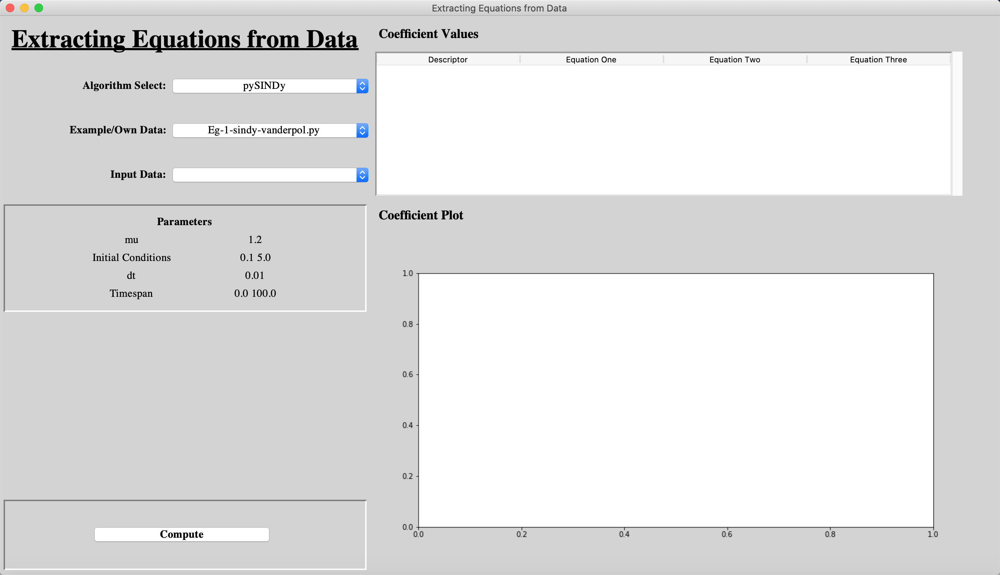

# SEED
 
**SEED**: **S**oftware for the **E**xtraction of **E**quations from **D**ata

## Table of contents
* [Introduction](#introduction)
* [Getting Started](#getting-started)
	* [Prerequisite](#prerequisite)
	* [Installing](#installing)
* [Usage](#usage)
	* [Running SEED](#running-SEED)
	* [Examples](#examples)
* [Lisense](#lisense)
* [Acknowledgments](#acknowledgments)

## Introduction
SEED is a software written in Python that allows for the extraction of data from data. It does this by collating algorithms written for research into one overall package. Currently there are two different algorithms integrated into SEED and the algorithms are:

* The Matlab SINDy code base written by the [Kutz Research Group](https://faculty.washington.edu/kutz/page26/) to accompany their paper [Discovering governing equations from data by sparse identification of nonlinear dynamical systems](https://www.pnas.org/content/113/15/3932.abstract)
* [PySINDy](https://github.com/luckystarufo/pySINDy), written by Yuying Liu, Yi Chu and Lianzong Wang, following on from the research of the Kutz Research group and other SINDy research

Any examples written for all sets of research have been edited for integration into SEED as to allow for the easy output of results. The ability to import a users own data has been added, to enable the analysis of further real world datasets.

SEED has an easy to use GUI to allow for researchers in many different fields to access the coded algorithms, although it is written in a way as to allow for the easy expansion of its capabilities. This enables users with a knowledge of programming to expand upon and improve the software.

## Getting Started

### Prerequisite
In order to run SINDy, Python 3.7 must be installed on your computer. If not, it can be downloaded and installed from [the Python website](https://www.python.org/downloads/release/python-377/).

In order to run the Matlab examples written by the Kutz Research Group, Matlab must be installed. This isn't required to run SEED however as Matlab has to be purchased. If the user has Matlab installed, the Matlab engine for Python must be installed. This can be done by running these commands in the terminal or command line:
 Mac: 

> _cd /_
> 
> _cd Applications/MATLAB\_R2019b.app/extern/engines/python_
>  (**Change the name of your Matlab app to the version you have downloaded**)
> 
> _python3 setup.py install_

Windows:

> _Coming soon_

### Installing
After downloading the source code from GitHub, save all of the files in a folder called _SEED_. This allows the programme to find the correct filepath to run the examples.

Before running SEED, it is vital to install the Python packages needed for the programme to run. This can be done by running these commands in the terminal or command line:
 Mac: 

> _python3 -m pip install --user numpy scipy matplotlib pysindy findiff pytest pylint sphinx_

Windows:

> _Coming soon_

## Usage

### Running SEED
To run SEED, open the Python IDLE and open the file _SEED.py_ in the _SEED_ folder created earlier. Click _Run_ > _Run Module_ to run the software. The GUI will start up and will look like this:

SEED can also be run with Jupyter Notebook. As well as the _SEED.py_ file, there is a _SEED.ipynb_ for those using Jupyter. The code is the same.

### Examples
There are examples.

The third PySINDy example needs data.

## Lisense
The MIT Lisense is used for this software. For more information see: [Lisense info](https://github.com/M-Vause/SEED/blob/master/LICENSE)

## Acknowledgments

