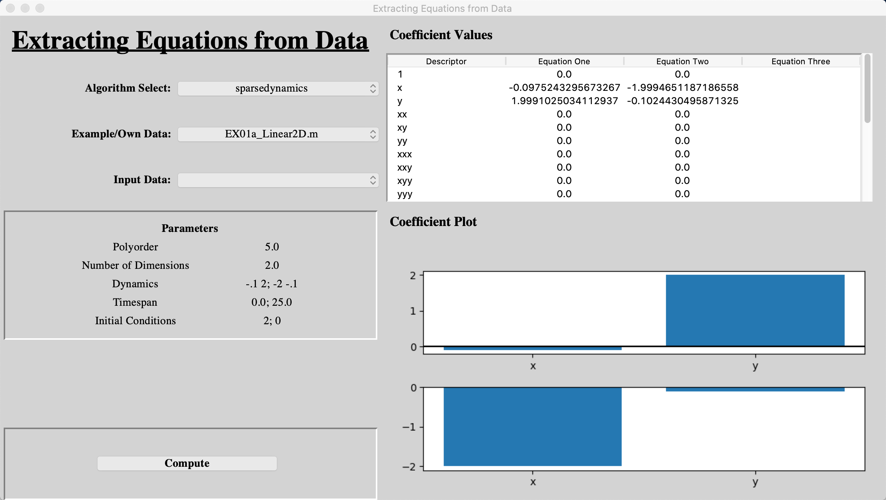
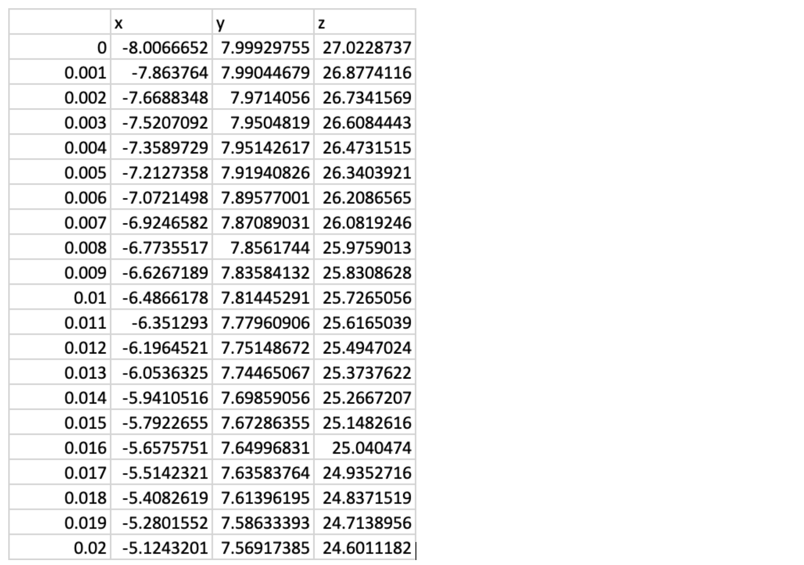

# SEED
 
**SEED**: **S**oftware for the **E**xtraction of **E**quations from **D**ata

## Table of contents
* [Introduction](#introduction)
* [Getting Started](#getting-started)
	* [Prerequisite](#prerequisite)
	* [Installing](#installing)
* [Usage](#usage)
	* [Running SEED](#running-SEED)
	* [Examples](#examples)
	* [Using your own data](#using-your-own-data)
* [Expansion](#expansion)
* [Lisense](#lisense)
* [Acknowledgments](#acknowledgments)

## Introduction
SEED is a software written in Python that allows for the extraction of governing differential equations from data. We have collated various algorithms written for research purposes into one overall toolbox and provided a GUI for their ease of use. Currently there are two different algorithms integrated into SEED:

* The Matlab SINDy code base written by the [Kutz Research Group](https://faculty.washington.edu/kutz/page26/) to accompany their paper [Discovering governing equations from data by sparse identification of nonlinear dynamical systems](https://www.pnas.org/content/113/15/3932.abstract)
* [PySINDy](https://github.com/luckystarufo/pySINDy), written by Yuying Liu, Yi Chu and Lianzong Wang, following on from the research of the Kutz Research group and other SINDy research

Both algorithms use the Sparse Identification of Nonlinear Dynamics (SINDy) method, although we are aware that there are others, and provide different implementations of it.  
We have edited the examples provided with each algorithm in order to integrate them into SEED, but they otherwise remain unedited.  
WE have also adapted each algorithm to give SEED the ability to import a users own data, therefore enabling the analysis of further real world datasets.

SEED has a simple and intuitive Graphical User Interface (GUI) so that researchers, without needing to have a knowledge of programming, in a wide variety of fields can analyse their data with cutting edge methods.  
SEED was also programmed in a way as to allow for the easy expansion of its capabilities, enabling users with a knowledge of programming to expand upon and improve the software.

## Getting Started

### Prerequisite
In order to run SEED, Python 3.6 or 3.7 must be installed on your computer. If it isn't, it can be downloaded and installed from [the Python website](https://www.python.org/downloads/release/python-377/). If you are a windows user, ensure you check the box _"Add Python 3.7 to Path"_ on the first page of the installation.

In order to run the Matlab examples written by the [Kutz Research Group](https://faculty.washington.edu/kutz/page26/), Matlab must be installed. This isn't required to run SEED however as Matlab has to be purchased.  
If you have Matlab installed and would like to run the Matlab examples, the Matlab Engine for Python must be installed for the same version of Python you are using on your computer. This can be done by following the instuctions on [the Matlab website](https://www.mathworks.com/help/matlab/matlab_external/install-the-matlab-engine-for-python.html).

### Installing
After downloading the source code from GitHub, save all of the files in the same folder anywhere you would like. This allows the programme to find the correct filepath to run the examples.

Before running SEED, it is vital to install the Python packages needed for the programme to run. This can be done by running these commands in the terminal or command line (**_If you intend to run SEED through Jupyter Notebook, see the next paragraph!_**):

* Mac: 

> _python3 -m pip install --user numpy scipy matplotlib pysindy findiff pytest pylint sphinx_

* Windows:

> _python -m pip install --user numpy scipy matplotlib pysindy findiff pytest pylint sphinx_

SEED can also be run with Jupyter Notebook as a _.ipynb_ file is available as well as the _.py_ file. The code is the same. Before running SEED in Jupyter Notebook, it is vital to install a few Python packages needed for the programme to run. This can be done by running these commands in the terminal or command line:

> _python -m pip install --user numpy scipy matplotlib pysindy findiff pytest pylint sphinx_

## Usage

### Running SEED
To run SEED, open the Python IDLE (included with the Python download) and open the file _SEED.py_. Click _Run > Run Module_ on the toolbar to run the software. If running SEED through Jupyter Notebook, open _SEED.ipynb_ in a Jupyter Notebook server and run all lines of code. 

The GUI will start up and will look like this:

* Mac:

* Windows:

### Examples
The algorithms that have been integrated into SEED come with their own set of examples that were provided with the original research. We have edited the examples to allow for their integration into SEED, but they otherwise remain unedited. 

The data needed to run the third PySINDy example was too large to upload to GitHub. The generation script, _reaction\_diffusion.m_, is included in the _Algorithms > pySINDy > datasets_ directory. Matlab is needed to run the script and generate the _reaction\_diffusion.mat_ data file.

After you run an example, the output will look like this:

* Mac:

* Windows:

To understand how to interpret the output fully, consult the algorithm's documentation linked in the [Introduction](#introduction).

### Using your own data
In order to use your own data with the algorithms, the data must be saved as a _.csv_ file with one column of time series data, and up to three further columns containing the data for each recorded variable. The first row of your _.csv_ file must be the names of each variable.  
An example is shown below:

Your _.csv_ file must then be saved in the _SEED > Data_ folder in order to be found by the programme. There is an example of a data file, _3d\_data.csv_, in the _Data_ folder previously mentioned.

## Expansion
Coming soon

## Lisense
The MIT License is used for this software. For more information see: [License info](https://github.com/M-Vause/SEED/blob/master/LICENSE)

## Acknowledgments

